<!DOCTYPE html>
<html lang="en">
<head>
    <meta charset="UTF-8">
    <meta name="viewport" content="width=device-width, initial-scale=1.0">
    <title>Test Results</title>
</head>
<body>

<h1>
Harshal Shirsath 
shirsath@umd.edu 
CMSC848F 
Assignment 4
</h1>
<h1>1. Classification Model </h1>
<h2>1.1 Test Accuracy for cls</h2>

<!-- Test Accuracy -->

Test Accuracy: 0.9328436

<h2>1.2 Ground Truth Point Clouds</h2>

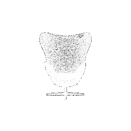
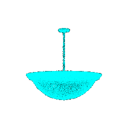
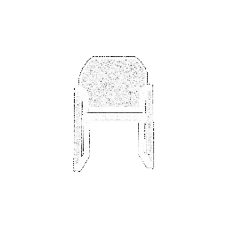

<h2>1.3Predicted Point Clouds</h2>
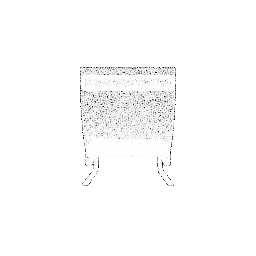
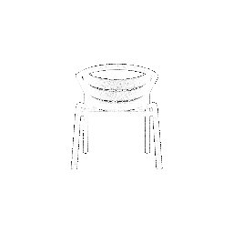

Test accuracy: 0.9328436516264428 
Object 609: Predicted Class = 0 
Object 361: Predicted Class = 0 
Object 495: Predicted Class = 0 
Object 887: Predicted Class = 2 
Object 294: Predicted Class = 0 
Failure Prediction for Class 0: Predicted Class = 2, True Class = 0.0 
Failure Prediction for Class 1: Predicted Class = 0, True Class = 1.0 
Failure Prediction for Class 2: Predicted Class = 1, True Class = 2.0 

<!-- Add more visualizations as needed -->

<!-- Failure Predictions -->
<h2>1.4 Failure Predictions</h2>
<h3>1.4.1. Chair</h3>
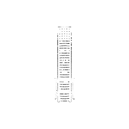
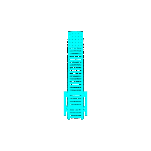

Interpretation: It is able to predict ladder as a chair all because of it's 4 legs as seen in the model
    However, the ladder belongs to a different class and due to similar features like the legs of the chair
    It considers the object as a chair and not like a ladder.

<h3>1.4.2.Vase</h3>
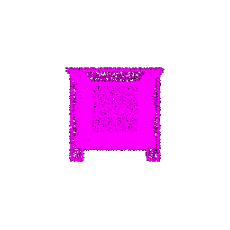

Interpretation: The vase presented as table cot may be due to the reason of points placed in a particular sequence 
    just as table and this is turning the prediction towards table as vase.

<h3>1.4.3. Lamp</h3>

Interpretation: It considers globe as lamp since due to the quite similar similar shapes or appearance from certain viewpoints.
    Thus, it misclassifies these instances where the distinguishing features are not prominent across classes.

<h1>2.Segmentation Model </h1>
<h2>1.Test Accuracy for seg</h2>

Test Accuracy: 0.838523500

<h2>2.1 Ground Truth Seg Point Clouds</h2>

<h3>Ground Truth seg</h3>

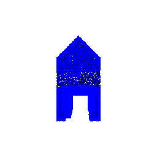
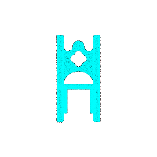

<h2>2.2 Prediction Point Clouds</h2>
<h3>Predicted seg</h3>
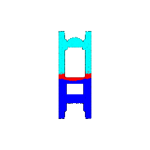

 Prediction accuracy:0.9085 

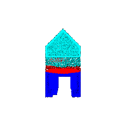

 Prediction accuracy: 0.8687 

 Prediction accuracy: 0.9543

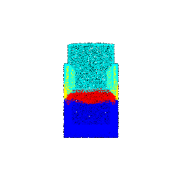

 Prediction accuracy: 0.8812

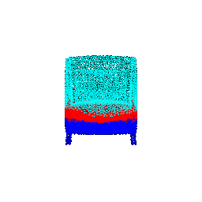

 Prediction accuracy: 0.567 

<h2>2.3 Interpretation</h2>

 A segmentation model, loads a pre-trained checkpoint, and evaluates 
    its performance on
    randomly selected objects from a test dataset.
    For each object, it selects a subset of points, makes predictions, 
    calculates accuracy, and visualizes the segmentation results in terms 
    of ground truth and predicted labels. 
    The accuracy metrics demonstrate the model's effectiveness in segmenting 
    objects from the point cloud data, and the visualization provides insights
    into the segmentation quality for each selected object. The random selection 
    of objects allows for a diverse assessment of the model's generalization capabilities.

   

</body>
</html>

<h1>3. Robustness Analysis</h1>
<h2>3.1. Describe the Procedure</h2>

1. Loading the labeled data (test_label and test_data) 
2. Initializing the segmentation and classification model 
3. Loading the pre-trained model checkpoint from a specified path for both segmentation and classification models 
4. Defining the rotate_point_cloud function to rotate the input point cloud by a specified angle (30 degrees in this case) for both classification and segmentation 
5. Creating visualization directories 
6. Rotating and predicting after rotating the dataset by 30 degrees using the rotate_point_cloud function 
7. Obtaining model predictions for every batch 
8. Visualizing ground truth, predicted segmentation, and classification results and saving them 
9. Computing test accuracy based on the predicted labels and ground truth labels 

<h2>3.2. Test accuracy and Visualization</h2>
<h3>Classification </h3>
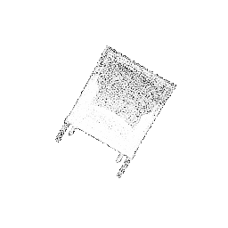

 Test accuracy:0.9085 

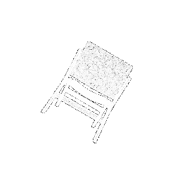

 Prediction accuracy: 0.8687 

 Prediction accuracy: 0.9543

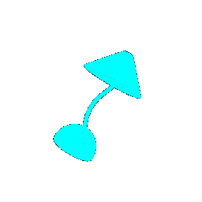

 Prediction accuracy: 0.8812

 Prediction accuracy: 0.567 

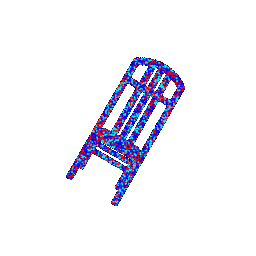
<h2>3.3. Comparison</h2>

<h3>Classification Task:</h3>
In a classification task, the goal is to assign a single label to the entire input 
point cloud. Therefore, the colors in the visualization represent the predicted class  
labels for the entire object. Since each object is assigned a single label, all parts  
of the object are visualized with the same color. The goal is to determine the overall 
category of the object rather than identifying specific parts

<h3>Segmentation Task:</h3>
In a segmentation task, the goal is to assign a label to each point in the input point 
cloud, effectively segmenting the object into different parts. In the visualization,  
different colors are used to represent different segmented parts of the object. This  
allows for a more detailed understanding of the object's structure,  
as each color corresponds to a specific segment or part. 

Classification: If the classification results show similar colors for the entire object, 
it indicates that the model is focusing on the overall category or class of the object. 

Segmentation: If the segmentation results show variations in colors for different parts of  
the object, it suggests that the model is successfully segmenting the object into 
distinct regions or components.

<h2>3.4 Interpretation</h2>

 The classification results, as visualized in the provided code, show objects with uniform
    colors, indicating that the model is successfully assigning overall class labels to the 
    entire point clouds. In contrast, the segmentation results exhibit a rich variety of colors, 
    signifying the model's ability to discern and categorize different parts of the objects.  
    This distinction underscores the nature of each task: classification focuses on identifying 
    the general category of an object, while segmentation delves into the detailed recognition 
    of individual components within the object. The visualizations thus align with the inherent  
    objectives and outcomes of classification and segmentation tasks in point cloud analysis.

The Website and representation is provided in the folder named: assignment4/Assignment4.html

1. Classification MOdel
To train the classification model run the command: python train.py --task cls
To Visualize, check test accuracy, and store the point cloud use: python eva_cls.py

2. Segmentation Model
To train the segmentation model run the command: python train.py --task cseg
To Visualize, check test accuracy, and store the point cloud use: python eva_cls.py

To rotate the dataset for classification the function used is : viz_cls_rotate
To rotate the dataset for segmentation the function used is : viz_seg_rotate

 ## Overview
In this assignment, you will implement a PointNet based architecture for classification and segmentation with point clouds (you don't need to worry about the tranformation blocks). Q1 and Q2 focus on implementing, training and testing models. Q3 asks you to quantitatively analyze model robustness. Q4 (extra point) involves locality. 

`models.py` is where you will define model structures. `train.py` loads data, trains models, logs trajectories and saves checkpoints. `eval_cls.py` and `eval_seg.py` contain script to evaluate model accuracy and visualize segmentation result. Feel free to modify any file as needed.

## Data Preparation
Download zip file (~2GB) from https://drive.google.com/file/d/1wXOgwM_rrEYJfelzuuCkRfMmR0J7vLq_/view?usp=sharing. Put the unzipped `data` folder under root directory. There are two folders (`cls` and `seg`) corresponding to two tasks, each of which contains `.npy` files for training and testing.

## Q1. Classification Model
Implement the classification model in `models.py`.

- Input: points clouds from across 3 classes (chairs, vases and lamps objects)

- Output: propapibility distribution indicating predicted classification (Dimension: Batch * Number of Classes)

Complete model initialization and prediction in `train.py` and `eval_cls.py`. Run `python train.py --task cls` to train the model, and `python eva_cls.py` for evaluation. Check out the arguments and feel free to modify them as you want.

Deliverables: On your website, 

- Report the test accuracy.

- Visualize a few random test point clouds and mention the predicted classes for each. Also visualize at least 1 failure prediction for each class (chair, vase and lamp),  and provide interpretation in a few sentences.  

## Q2. Segmentation Model
Implement the segmentation model in `models.py`.  

- Input: points of chair objects (6 semantic segmentation classes) 

- Output: segmentation of points (Dimension: Batch * Number of Points per Object * Number of Segmentation Classes)

Complete model initialization and prediction in `train.py` and `eval_seg.py`. Run `python train.py --task seg` to train the model. Running `python eval_seg.py` will save two gif's, one for ground truth and the other for model prediction. Check out the arguments and feel free to modify them as you want. In particular, you may want to specify `--i` and `--load_checkpoint` arguments in `eval_seg.py` to use your desired model checkpoint on a particular object.

Deliverables: On your website 

- Report the test accuracy.

- Visualize segmentation results of at least 5 objects (including 2 bad predictions) with corresponding ground truth, report the prediction accuracy for each object, and provide interpretation in a few sentences.
  
## Q3. Robustness Analysis (20 points) 
Conduct 2 experiments to analyze the robustness of your learned model. Some possible suggestions are:
1. You can rotate the input point clouds by certain degrees and report how much the accuracy falls
2. You can input a different number of points points per object (modify `--num_points` when evaluating models in `eval_cls.py` and `eval_seg.py`)

Feel free to try other ways of probing the robustness. Each experiment is worth 10 points.

Deliverables: On your website, for each experiment

- Describe your procedure 
- For each task, report test accuracy and visualization on a few samples, in comparison with your results from Q1 & Q2.
- Provide some interpretation in a few sentences.

## Reminder
If your job get killed during evaluation, it's mostly because the CPU runs out of memory.
You can either try:
1. Take a smaller batch size for the test data.
2. Use a larger memory for your GPU. Change the memory size for the on demand GPU.
	
	srun --pty --partition=class --account=class --mem=64gb --qos=high --gres=gpu:1 bash

 ## Overview
In this assignment, you will implement a PointNet based architecture for classification and segmentation with point clouds (you don't need to worry about the tranformation blocks). Q1 and Q2 focus on implementing, training and testing models. Q3 asks you to quantitatively analyze model robustness. Q4 (extra point) involves locality. 

`models.py` is where you will define model structures. `train.py` loads data, trains models, logs trajectories and saves checkpoints. `eval_cls.py` and `eval_seg.py` contain script to evaluate model accuracy and visualize segmentation result. Feel free to modify any file as needed.

## Data Preparation
Download zip file (~2GB) from https://drive.google.com/file/d/1wXOgwM_rrEYJfelzuuCkRfMmR0J7vLq_/view?usp=sharing. Put the unzipped `data` folder under root directory. There are two folders (`cls` and `seg`) corresponding to two tasks, each of which contains `.npy` files for training and testing.

## Q1. Classification Model
Implement the classification model in `models.py`.

- Input: points clouds from across 3 classes (chairs, vases and lamps objects)

- Output: propapibility distribution indicating predicted classification (Dimension: Batch * Number of Classes)

Complete model initialization and prediction in `train.py` and `eval_cls.py`. Run `python train.py --task cls` to train the model, and `python eva_cls.py` for evaluation. Check out the arguments and feel free to modify them as you want.

Deliverables: On your website, 

- Report the test accuracy.

- Visualize a few random test point clouds and mention the predicted classes for each. Also visualize at least 1 failure prediction for each class (chair, vase and lamp),  and provide interpretation in a few sentences.  

## Q2. Segmentation Model
Implement the segmentation model in `models.py`.  

- Input: points of chair objects (6 semantic segmentation classes) 

- Output: segmentation of points (Dimension: Batch * Number of Points per Object * Number of Segmentation Classes)

Complete model initialization and prediction in `train.py` and `eval_seg.py`. Run `python train.py --task seg` to train the model. Running `python eval_seg.py` will save two gif's, one for ground truth and the other for model prediction. Check out the arguments and feel free to modify them as you want. In particular, you may want to specify `--i` and `--load_checkpoint` arguments in `eval_seg.py` to use your desired model checkpoint on a particular object.

Deliverables: On your website 

- Report the test accuracy.

- Visualize segmentation results of at least 5 objects (including 2 bad predictions) with corresponding ground truth, report the prediction accuracy for each object, and provide interpretation in a few sentences.
  
## Q3. Robustness Analysis 
Conduct 2 experiments to analyze the robustness of your learned model. Some possible suggestions are:
1. You can rotate the input point clouds by certain degrees and report how much the accuracy falls
2. You can input a different number of points points per object (modify `--num_points` when evaluating models in `eval_cls.py` and `eval_seg.py`)

Feel free to try other ways of probing the robustness. Each experiment is worth 10 points.

Deliverables: On your website, for each experiment

- Describe your procedure 
- For each task, report test accuracy and visualization on a few samples, in comparison with your results from Q1 & Q2.
- Provide some interpretation in a few sentences.

